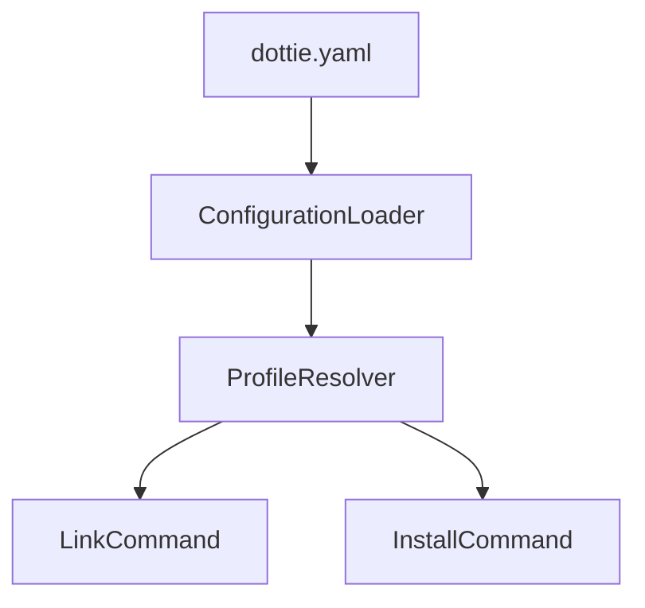

# FEATURE-17: Documentation Website

## Overview

Create a documentation website for Dottie hosted on GitHub Pages, built with **Docusaurus**. The Docusaurus project (config, theme, static assets) will live in `/website`, while the documentation content (Markdown files) will live in `/docs` at the repo root. The site is automatically deployed via GitHub Actions on push to `main`.

**Published URL:** `https://ryandanthony.github.io/dottie/`

## Decisions

| Decision         | Choice                                      | Rationale                                                                   |
| ---------------- | ------------------------------------------- | --------------------------------------------------------------------------- |
| Framework        | Docusaurus v3                               | React-based, feature-rich, excellent Mermaid support, widely adopted by OSS |
| Source location  | `/website` (site) + `/docs` (content)       | Docusaurus tooling separated from Markdown content at repo root             |
| Hosting          | GitHub Pages                                | Free, native integration, no external services                              |
| Deployment       | GitHub Actions (auto on push to `main`)     | Fully automated, consistent with existing CI                                |
| Markdown support | Built-in (MDX)                              | Standard Markdown + JSX components when needed                              |
| Mermaid diagrams | `@docusaurus/theme-mermaid`                 | First-party plugin, renders in fenced code blocks                           |
| Dark mode        | Yes (built-in theme toggle)                 | Docusaurus ships with dark mode out of the box                              |
| Versioning       | `docusaurus-plugin-content-docs` versioning | Tag docs per release, version selector in navbar                            |
| Search           | Not required initially                      | Can add Algolia DocSearch or local search plugin later                      |

## Site Structure

The documentation site will be organized into the following top-level sections:

```
website/                              # Docusaurus project (site tooling)
├── docusaurus.config.ts              # Docusaurus configuration
├── sidebars.ts                       # Sidebar navigation structure
├── package.json                      # Node dependencies
├── static/                           # Static assets (images, favicon, etc.)
│   └── img/
├── src/                              # Custom pages and components
│   ├── pages/
│   │   └── index.tsx                 # Landing page
│   └── css/
│       └── custom.css                # Theme overrides
└── blog/                             # Optional: changelog / announcements

docs/                                 # Documentation content (Markdown)
├── getting-started/
│   ├── installation.md
│   ├── quick-start.md
│   └── first-config.md
├── configuration/
│   ├── overview.md
│   ├── profiles.md
│   ├── dotfiles.md
│   └── install-blocks.md
├── commands/
│   ├── validate.md
│   ├── link.md
│   ├── install.md
│   ├── apply.md
│   ├── status.md
│   └── initialize.md
├── guides/
│   ├── profile-inheritance.md
│   ├── github-releases.md
│   ├── apt-repos.md
│   ├── fonts.md
│   └── scripts.md
└── architecture/
    ├── overview.md
    ├── project-structure.md
    └── design-decisions.md
```

### Section Descriptions

| Section             | Purpose                                                                      |
| ------------------- | ---------------------------------------------------------------------------- |
| **Getting Started** | Installation, quick start guide, first configuration walkthrough             |
| **Configuration**   | Deep reference for `dottie.yaml` — profiles, dotfile entries, install blocks |
| **Commands**        | CLI command reference with options, examples, and output samples             |
| **Guides**          | Task-oriented how-to guides for specific use cases                           |
| **Architecture**    | Project structure, design decisions, contributor-facing documentation        |

## Mermaid Diagram Support

Docusaurus v3 supports Mermaid diagrams natively via the `@docusaurus/theme-mermaid` package. Diagrams are written as fenced code blocks with the `mermaid` language tag:

````markdown

````

Configuration in `docusaurus.config.ts`:

```typescript
export default {
    markdown: {
        mermaid: true,
    },
    themes: ["@docusaurus/theme-mermaid"],
    presets: [
        [
            "classic",
            {
                docs: {
                    path: "../docs", // Point to /docs at repo root
                    sidebarPath: "./sidebars.ts",
                },
            },
        ],
    ],
};
```

## Versioning Strategy

Documentation versions will be tagged alongside Dottie releases using Docusaurus's built-in versioning:

```bash
# When cutting a release, snapshot the current docs
npx docusaurus docs:version 1.0.0
```

This creates a `versioned_docs/version-1.0.0/` snapshot. The version selector in the navbar lets users switch between versions. The `/docs` directory always represents the "Next" (unreleased) version.

**Initial approach:** Start with unversioned docs. Enable versioning once Dottie reaches a stable release cadence.

## GitHub Pages Deployment

### Repository Configuration

GitHub Pages will be configured to deploy from GitHub Actions (not from a branch). This is set in **Settings → Pages → Source → GitHub Actions**.

### GitHub Actions Workflow

A new workflow file `.github/workflows/docs.yml` will handle build and deployment:

```yaml
name: Deploy Documentation

on:
    push:
        branches: [main]
        paths:
            - "website/**"
            - "docs/**"
    workflow_dispatch: # Allow manual trigger

permissions:
    contents: read
    pages: write
    id-token: write

concurrency:
    group: pages
    cancel-in-progress: true

jobs:
    build:
        runs-on: ubuntu-latest
        defaults:
            run:
                working-directory: ./website
        steps:
            - uses: actions/checkout@v4

            - uses: actions/setup-node@v4
              with:
                  node-version: 20
                  cache: npm
                  cache-dependency-path: website/package-lock.json

            - name: Install dependencies
              run: npm ci

            - name: Build
              run: npm run build

            - name: Upload artifact
              uses: actions/upload-pages-artifact@v3
              with:
                  path: website/build

    deploy:
        needs: build
        runs-on: ubuntu-latest
        environment:
            name: github-pages
            url: ${{ steps.deployment.outputs.page_url }}
        steps:
            - name: Deploy to GitHub Pages
              id: deployment
              uses: actions/deploy-pages@v4
```

### Path Filtering

The workflow only triggers on changes to the `website/` or `docs/` directories, so documentation builds don't slow down code-only PRs. The `workflow_dispatch` trigger allows manual rebuilds when needed.

## Theme & Visual Design

### Design Direction

The site should feel **modern, CLI-oriented, and developer-focused** — like a polished terminal. Think dark backgrounds, monospace accents, and a hacker-aesthetic that matches the tool's purpose as a dotfile/system bootstrapper.

### Color Palette

| Role             | Dark Mode         | Light Mode        |
| ---------------- | ----------------- | ----------------- |
| Background       | `#0d1117` (black) | `#ffffff` (white) |
| Surface/Card     | `#161b22`         | `#f6f8fa`         |
| Primary          | `#00ff41` (green) | `#16a34a`         |
| Primary hover    | `#00cc33`         | `#15803d`         |
| Text primary     | `#e6edf3`         | `#1f2937`         |
| Text secondary   | `#8b949e`         | `#6b7280`         |
| Border           | `#30363d`         | `#d1d5db`         |
| Code background  | `#0d1117`         | `#f0f0f0`         |
| Accent           | `#58a6ff` (blue)  | `#2563eb`         |

### Typography

- **Headings:** System sans-serif stack (Inter or similar)
- **Body:** System sans-serif
- **Code / CLI examples:** `JetBrains Mono`, `Fira Code`, or `monospace` — monospace font should be prominent since the tool is CLI-focused

### Visual Elements

- Terminal-style code blocks with green-on-black aesthetic
- Subtle green glow or underline accents on interactive elements
- Clean card-based layout for feature highlights on the landing page
- Mermaid diagrams should inherit the dark/green palette

### Images & Branding

Reference images are stored in `design-notes/FEATURE-17-documentation/`:

| File | Purpose |
| ---- | ------- |
| `Copilot_20260209_202104.png` | Branding / visual reference |
| `Copilot_20260209_202113.png` | Branding / visual reference |
| `Copilot_20260209_202117.png` | Branding / visual reference |
| `Copilot_20260209_202119.png` | Branding / visual reference |

These images should be used as inspiration and/or directly on the site (hero section, favicon, social card, etc.). Copy selected images into `website/static/img/` during implementation.

### Dark Mode (Default)

Dark mode is the default, matching the CLI-oriented aesthetic. Light mode is available via toggle.

```typescript
export default {
    themeConfig: {
        colorMode: {
            defaultMode: "dark",
            disableSwitch: false,
            respectPrefersColorScheme: true,
        },
    },
};
```

### Custom CSS (`website/src/css/custom.css`)

```css
:root {
    --ifm-color-primary: #16a34a;
    --ifm-color-primary-dark: #15803d;
    --ifm-color-primary-darker: #166534;
    --ifm-color-primary-darkest: #14532d;
    --ifm-color-primary-light: #22c55e;
    --ifm-color-primary-lighter: #4ade80;
    --ifm-color-primary-lightest: #86efac;
    --ifm-font-family-monospace: "JetBrains Mono", "Fira Code", monospace;
    --ifm-background-color: #ffffff;
}

[data-theme="dark"] {
    --ifm-color-primary: #00ff41;
    --ifm-color-primary-dark: #00cc33;
    --ifm-color-primary-darker: #00b32d;
    --ifm-color-primary-darkest: #008022;
    --ifm-color-primary-light: #33ff67;
    --ifm-color-primary-lighter: #66ff8d;
    --ifm-color-primary-lightest: #99ffb3;
    --ifm-background-color: #0d1117;
    --ifm-background-surface-color: #161b22;
    --ifm-font-color-base: #e6edf3;
    --ifm-font-color-secondary: #8b949e;
}

/* Terminal-style code blocks */
pre code {
    font-family: var(--ifm-font-family-monospace);
}

[data-theme="dark"] .prism-code {
    background-color: #0d1117 !important;
    border: 1px solid #30363d;
}
```

## Implementation Plan

### Phase 1: Scaffold & Deploy (MVP)

1. Initialize Docusaurus project in `/website`
    ```bash
    cd website
    npx create-docusaurus@latest . classic --typescript
    ```
2. Configure `docusaurus.config.ts`:
    - Site title, URL (`https://ryandanthony.github.io/dottie/`), base URL (`/dottie/`)
    - Enable Mermaid theme
    - Configure navbar with sections
    - Enable dark mode with system preference detection
3. Migrate key content from `README.md` into doc pages:
    - Installation → `getting-started/installation.md`
    - Quick Start → `getting-started/quick-start.md`
    - Configuration Reference → `configuration/` section
    - CLI Commands → `commands/` section
4. Create `.github/workflows/docs.yml` for automated deployment
5. Configure GitHub Pages in repository settings
6. Verify deployment to `https://ryandanthony.github.io/dottie/`

### Phase 2: Content Expansion

7. Write how-to guides from existing design notes
8. Create architecture documentation with Mermaid diagrams
9. Add landing page with project overview and feature highlights
10. Refine sidebar navigation and cross-linking between pages

### Phase 3: Versioning & Polish

11. Enable documentation versioning once release cadence is established
12. Add search (Algolia DocSearch or `docusaurus-search-local`)
13. Add a blog section for release notes / changelogs
14. Custom branding (logo, favicon, social card image)

## Local Development

```bash
cd website
npm install
npm start          # Start dev server at http://localhost:3000
npm run build      # Production build
npm run serve      # Serve production build locally
```

## Dependencies

| Package                      | Purpose                   |
| ---------------------------- | ------------------------- |
| `@docusaurus/core`           | Core framework            |
| `@docusaurus/preset-classic` | Standard theme + plugins  |
| `@docusaurus/theme-mermaid`  | Mermaid diagram rendering |
| `react`, `react-dom`         | Required by Docusaurus    |

## Open Questions

- **Custom domain:** Should a custom domain (e.g., `dottie.dev`) be configured instead of the default GitHub Pages URL?
- **Blog:** Should release notes be published as blog posts alongside docs?
- **Analytics:** Should we add a lightweight analytics solution (e.g., Plausible, Fathom)?

## References

- [Docusaurus documentation](https://docusaurus.io/docs)
- [Docusaurus Mermaid plugin](https://docusaurus.io/docs/markdown-features/diagrams)
- [Docusaurus versioning](https://docusaurus.io/docs/versioning)
- [GitHub Pages deployment](https://docusaurus.io/docs/deployment#deploying-to-github-pages)
- [GitHub Actions for Pages](https://docs.github.com/en/pages/getting-started-with-github-pages/configuring-a-publishing-source-for-your-github-pages-site#publishing-with-a-custom-github-actions-workflow)
