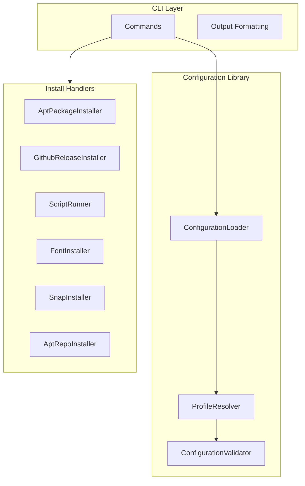
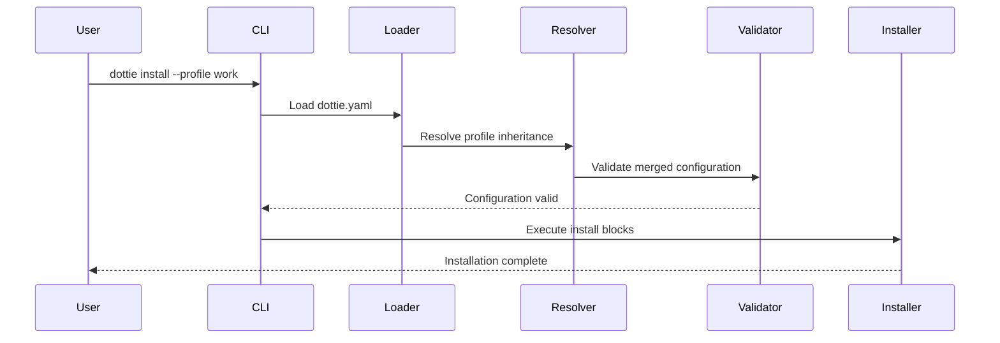

# Architecture Overview

dottie is built as a modular .NET CLI application with clear separation between configuration parsing, profile resolution, and command execution.

## Component Architecture

## Data Flow

## Key Design Principles

### Declarative Configuration

Configuration is treated as desired state. dottie compares the current system state against the declared configuration and only applies necessary changes.

### Idempotent Operations

All operations are designed to be safely repeatable. Running `dottie install` multiple times produces the same result as running it once.

### Safe by Default

- Dry-run mode for previewing changes
- Explicit confirmation for destructive operations
- Automatic backups when overwriting files

### Profile Composition

Profiles can extend other profiles, enabling reuse and customization without duplication.

## Next Steps

- [Project Structure](./project-structure) - Source code organization
- [Design Decisions](./design-decisions) - Key architectural choices
