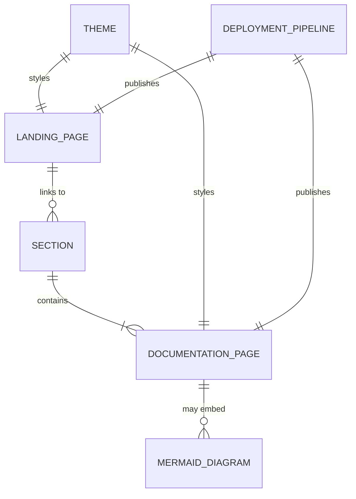

# Data Model: Documentation Website

**Feature**: 013-docs-website  
**Date**: 2026-02-09

## Overview

This feature produces a static documentation site. There is no runtime database or persistent storage. The "data model" describes the content entities and their relationships as they exist in the file system and Docusaurus configuration.

## Entities

### Documentation Page

A single Markdown file that represents one documentation topic.

| Attribute | Type | Description |
|-----------|------|-------------|
| `id` | string (derived) | Auto-generated from file path relative to docs root (e.g., `getting-started/installation`) |
| `title` | string | Set via frontmatter `title` field or first `# heading` |
| `sidebar_label` | string (optional) | Override label shown in sidebar (defaults to `title`) |
| `sidebar_position` | integer (optional) | Explicit ordering within its section |
| `description` | string (optional) | SEO/meta description, set via frontmatter |
| `content` | Markdown/MDX | The body content of the page |

**Frontmatter example**:
```yaml
---
title: Installation
sidebar_position: 1
description: How to install Dottie on Linux
---
```

**Relationships**:
- Belongs to exactly one **Section** (determined by parent directory)
- May contain embedded **Mermaid Diagrams**

### Section

A top-level grouping of documentation pages, represented as a directory in `/docs`.

| Attribute | Type | Description |
|-----------|------|-------------|
| `label` | string | Display name in sidebar (set via `_category_.json`) |
| `position` | integer | Sort order among sections (set via `_category_.json`) |
| `description` | string (optional) | Shown under section heading in sidebar |
| `dirName` | string (derived) | Directory name (e.g., `getting-started`) |

**Instances**:

| Directory | Label | Position |
|-----------|-------|----------|
| `getting-started/` | Getting Started | 1 |
| `configuration/` | Configuration | 2 |
| `commands/` | Commands | 3 |
| `guides/` | Guides | 4 |
| `architecture/` | Architecture | 5 |

**Relationships**:
- Contains one or more **Documentation Pages**
- Appears as a collapsible group in the sidebar

### Landing Page

A custom React component (`/website/src/pages/index.tsx`) that serves as the site entry point. Not part of the docs sidebar.

| Attribute | Type | Description |
|-----------|------|-------------|
| `route` | string | Always `/` (relative to baseUrl) |
| `title` | string | Page title (shown in browser tab) |
| `tagline` | string | Subtitle shown in hero section |
| `features` | array | Feature highlight cards shown on the landing page |

**Relationships**:
- Links to **Sections** via call-to-action buttons

### Theme

The visual presentation configuration, split across config and CSS.

| Attribute | Location | Description |
|-----------|----------|-------------|
| `colorMode.defaultMode` | `docusaurus.config.ts` | Default theme: `dark` |
| `colorMode.respectPrefersColorScheme` | `docusaurus.config.ts` | Honor system preference: `true` |
| `--ifm-color-primary-*` (light) | `custom.css :root` | Green palette for light mode |
| `--ifm-color-primary-*` (dark) | `custom.css [data-theme="dark"]` | Terminal green palette for dark mode |
| `--ifm-background-color` (dark) | `custom.css [data-theme="dark"]` | `#0d1117` (GitHub dark) |

### Deployment Pipeline

The GitHub Actions workflow that builds and publishes the site.

| Attribute | Type | Description |
|-----------|------|-------------|
| `trigger.push.branches` | array | `[main]` |
| `trigger.push.paths` | array | `[website/**, docs/**]` |
| `trigger.workflow_dispatch` | boolean | `true` (manual trigger) |
| `node_version` | integer | `20` |
| `build_command` | string | `npm run build` |
| `artifact_path` | string | `website/build` |

## Entity Relationship Diagram



## State Transitions

No runtime state transitions exist. The site is statically generated at build time and served as immutable files. The only "state" is the color mode preference, which is stored in the browser's `localStorage` by Docusaurus and has two values: `light` and `dark`.
