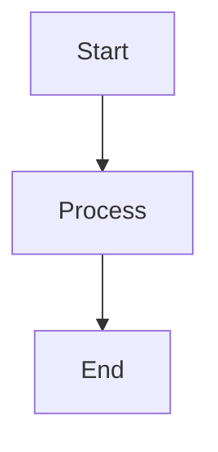

# Quickstart: Documentation Website

**Feature**: 013-docs-website  
**Date**: 2026-02-09

## Prerequisites

- Node.js 20+ installed (`node --version`)
- npm 10+ installed (`npm --version`)

## Local Development

### First-Time Setup

```bash
# From repository root
cd website
npm install
```

### Start Dev Server

```bash
cd website
npm start
```

This starts a local development server at `http://localhost:3000/dottie/` with hot-reload. Changes to Markdown files in `/docs` and site configuration in `/website` are reflected immediately in the browser.

### Build for Production

```bash
cd website
npm run build
```

The build validates all Markdown content, checks for broken links, and outputs static files to `website/build/`. A successful build is the primary validation gate for all documentation changes.

### Serve Production Build Locally

```bash
cd website
npm run serve
```

Serves the production build at `http://localhost:3000/dottie/` for final verification before deploying.

## Adding Documentation

### Add a New Page

1. Create a Markdown file in the appropriate `/docs` subdirectory:
   ```bash
   # Example: new guide
   touch docs/guides/my-new-guide.md
   ```

2. Add frontmatter at the top:
   ```yaml
   ---
   title: My New Guide
   sidebar_position: 6
   ---
   ```

3. Write content in Markdown. The page automatically appears in the sidebar.

### Add a Mermaid Diagram

Use a fenced code block with the `mermaid` language tag:

````markdown

````

### Add a New Section

1. Create a directory under `/docs`:
   ```bash
   mkdir docs/new-section
   ```

2. Add a `_category_.json` file:
   ```json
   {
     "label": "New Section",
     "position": 6
   }
   ```

3. Add Markdown pages to the directory.

## Deployment

Deployment is fully automated. Push changes to `docs/` or `website/` on the `main` branch and GitHub Actions builds and deploys the site automatically.

Manual deployment can be triggered from the Actions tab using the `workflow_dispatch` trigger on the `docs.yml` workflow.

## Troubleshooting

| Issue | Fix |
|-------|-----|
| Build fails on broken link | Check the error message for the specific file and link; fix the Markdown reference |
| Mermaid diagram shows as code block | Verify `markdown.mermaid: true` in `docusaurus.config.ts` and `@docusaurus/theme-mermaid` in themes |
| CSS changes not reflected | Hard-refresh browser (`Ctrl+Shift+R`) or restart dev server |
| Sidebar order is wrong | Check `sidebar_position` frontmatter or `_category_.json` `position` values |
